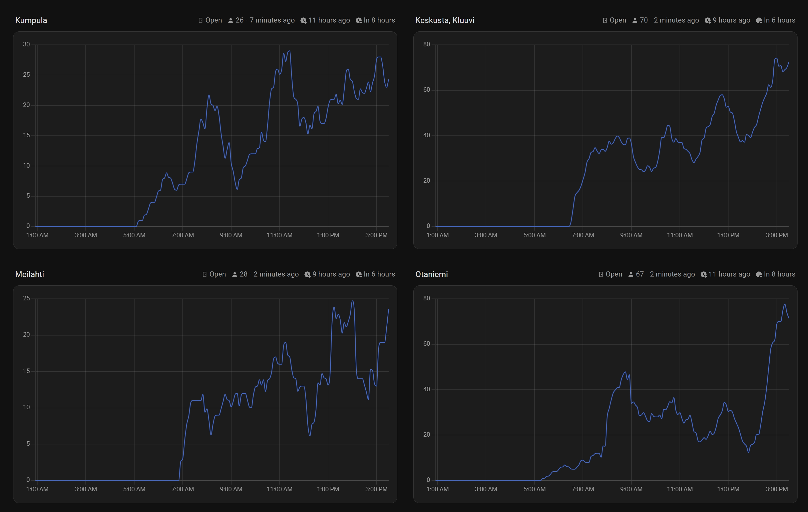

# Home Assistant Unisport Intergration

This intergration provides Unisport related states in Home Assistant, like the number of visitors in a gym location, and opening & closing times.

## How?

[](https://my.home-assistant.io/redirect/hacs_repository/?owner=chenseanxy&repository=hass_unisport&category=integration)

Install via [HACS](https://www.hacs.xyz/docs/use/) by using the link above, or manually add this repo (`chenseanxy/hass_unisport`) as a [custom repository](https://www.hacs.xyz/docs/faq/custom_repositories/).

After installing and restarting your Home Assistant instance, configure this intergration by navigating to Settings -> Device and Services, and press "Add Intergration" on the bottom corner.

Alternatively, add this line to your `configuration.yaml`:

```yaml
unisport:
```

There are no configurations required otherwise. You can enable / disable the different entities at different locations based on your needs.

## Why?

Fancy graphs go brrrrr




## What?

This intergration provides the following entities for each gym location:

| Name | Description | Enabled by Default |
| ---- | ----------- | ------------------ |
| Visitors | Number of live visitors currently in the location, updates every 5 minutes | Yes |
| Capacity | Stated capacity of the gym location stated by unisport.fi | Yes |
| Status | Whether the location is currently open or closed, calucated from the schedule stated by unisport.fi | Yes |
| Opening Time Today | Today's opening time of the location, calculated from the schedule stated by unisport.fi | No |
| Closing Time Today | Today's closing time of the location, calculated from the schedule stated by unisport.fi | No |

> Nb: schedule-based entities may not reflect actual opening times during holidays, depending on the accuracy of the unisport's `populartimes` page.

Data provided by `https://oma.enkora.fi/unisport/populartimes`.

## Contributing

See [Contributing](CONTRIBUTING.md)
